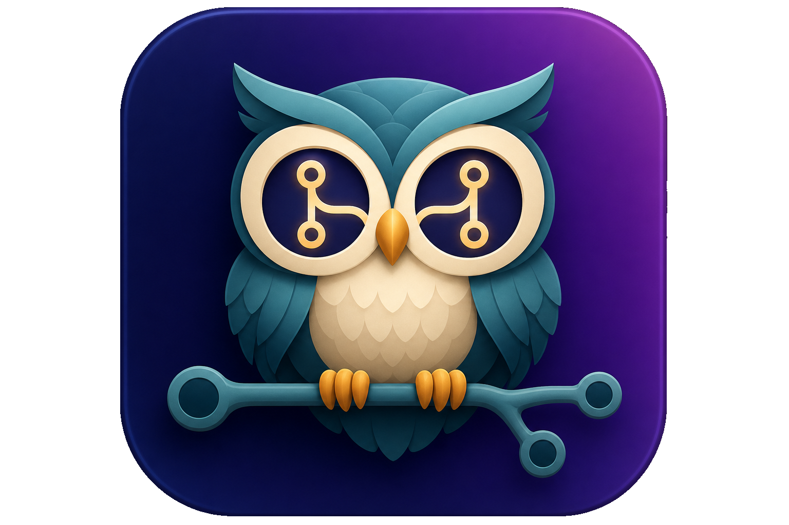

<p align="center">
  
</p>

# PRowl

A native macOS menu-bar app that watches your open GitHub pull requests and
sends a native notification whenever something happens to them. The name is a
play on "PR" + "owl" (a watchful night creature) + "prowl".

Built with SwiftUI (macOS 13+ menu-bar app). Authenticate with the GitHub CLI
(`gh auth login`) or a Personal Access Token stored in the macOS Keychain.

## Development vs App Store

This repo has **two build paths** that share the same source files in
`Sources/PRowl/`:

| | Daily dev (Cursor) | Direct download (DMG) | App Store release |
|---|---|---|---|
| **Edit code** | Cursor | Cursor | Cursor (same files) |
| **Build** | `./build.sh` | `./dmg.sh` | `./release.sh` |
| **Project** | `Package.swift` | `Package.swift` | `PRowl.xcodeproj` |
| **Signing** | Ad-hoc (local) | Developer ID (optional) | Apple Distribution |
| **Sandbox** | No | No | Yes (required) |

You do **not** need to open Xcode for normal development. The `.xcodeproj` exists
for archiving, signing, and App Store submission only.

After adding new Swift files, regenerate the Xcode project:

```bash
./scripts/generate-xcodeproj.sh
```

## Features

- Lives in the menu bar (no Dock icon).
- Lists open PRs across configurable sets: authored by you, review requested, assigned.
- Each row shows repo, PR number, title, and a color-coded status.
- Click a PR to open it in your browser.
- Polls GitHub on a configurable interval (30s - 10m).
- The menu-bar glyph changes to flag failing CI, a merge conflict, or a PR that's ready to merge.

### Configuration screen

Open it from the menu-bar popover via the gear icon. It has four sections:

- **API & authentication** -- set the GraphQL API endpoint (defaults to github.com;
  override for GitHub Enterprise) and choose **Personal access token** or **GitHub CLI (gh)**.
- **Which PRs to watch** -- authored by me, review requested, assigned to me.
- **Notify me about** -- choose exactly which events trigger a notification:
  - New comment
  - Approved
  - Changes requested
  - Review required
  - Merge conflict
  - CI failed
  - CI passed
  - Ready to merge
  - Marked ready for review (un-drafted)
  - Merged
  - Closed
- **Check every** -- polling interval.

All settings persist across launches. Notification preferences default to all
events enabled; toggle the ones you don't care about off.

## Requirements

- macOS 13 (Ventura) or later
- Swift toolchain (Xcode or Command Line Tools) to build

## Authentication

PRowl needs read access to your pull requests via the GitHub GraphQL API. Pick one method in Settings:

### GitHub CLI (recommended if you already use `gh`)

1. Install from https://cli.github.com if needed.
2. Run `gh auth login` in Terminal (OAuth — works with many orgs that block classic PATs).
3. In PRowl Settings, choose **GitHub CLI (gh)**.

PRowl runs `gh auth token` to obtain the same bearer token `gh` uses for API calls. It does not bundle or redistribute the CLI; it only reads credentials from your existing install.

### Personal access token

Some organizations (including those that block classic PATs) require a **fine-grained** token.

#### Fine-grained token (recommended for PAT mode)

1. Go to https://github.com/settings/tokens?type=beta
2. Generate a token with **Pull requests: Read-only** on the repositories and organizations you use
3. In PRowl Settings, choose **Personal access token**, paste it, and click **Save Token**

#### Classic token

1. Go to https://github.com/settings/tokens
2. Create a token (classic) with these scopes:
   - `repo` (read access to your repositories' PRs)
   - `read:org` (so org PRs and review requests resolve correctly)
3. Copy the token; paste it into PRowl Settings once.

Classic tokens fail when an organization policy forbids them — use fine-grained or GitHub CLI instead.

## Build & run (daily development)

```bash
./build.sh            # release build, produces "PRowl.app"
open "PRowl.app"
```

`build.sh` compiles with Swift Package Manager, assembles a `.app` bundle from
`Resources/Info.plist`, and ad-hoc code-signs it (required for notifications).
Use this for all day-to-day work in Cursor.

Then:

1. Click the menu-bar icon -> the gear (Configuration).
2. Choose **GitHub CLI (gh)** or paste a Personal Access Token under **Personal access token**.
3. Choose which PR sets to watch, which events to be notified about, and the interval.
4. Approve the macOS notification permission prompt the first time.

## DMG (direct download)

To package `PRowl.app` as a disk image for sharing outside the App Store:

```bash
./dmg.sh
open build/PRowl.dmg
```

This runs `./build.sh`, stages the app with a shortcut to `/Applications`, and
writes a compressed image to `build/PRowl.dmg`. Users drag PRowl into Applications
to install.

**For yourself:** the ad-hoc signed build from `./dmg.sh` is enough.

**For other Macs:** sign with a [Developer ID Application](https://developer.apple.com/developer-id/) certificate, then notarize:

```bash
SIGN_IDENTITY="Developer ID Application: Your Name (TEAMID)" ./dmg.sh

xcrun notarytool submit build/PRowl.dmg \
  --keychain-profile "AC_PASSWORD" \
  --wait

xcrun stapler staple build/PRowl.dmg
```

Notarization is required for macOS Gatekeeper to allow the app on machines that
didn't build it. App Store distribution uses `./release.sh` instead (`.pkg`, not `.dmg`).

## App Store release

Requires **full Xcode** (not Command Line Tools alone) and an [Apple Developer
Program](https://developer.apple.com) membership.

1. Set your Team ID in `project.yml` (`DEVELOPMENT_TEAM`) or pass it at release time.
2. Archive and export from the terminal (no Xcode GUI required):

```bash
DEVELOPMENT_TEAM=XXXXXXXXXX ./release.sh
```

This runs `./scripts/generate-xcodeproj.sh`, archives with `xcodebuild`, and
exports a Mac App Store package to `build/export/`.

Upload with [Transporter](https://apps.apple.com/app/transporter/id1450874784) or:

```bash
xcrun altool --upload-app -f "build/export/PRowl.pkg" -t macos
```

The Xcode project is generated from [`project.yml`](project.yml) via
[XcodeGen](https://github.com/yonaskolb/XcodeGen) (`brew install xcodegen`).
Entitlements for the sandboxed App Store build live in
[`PRowl/PRowl.entitlements`](PRowl/PRowl.entitlements).

**One-time setup:** open `PRowl.xcodeproj` in Xcode only if you need to configure
Signing & Capabilities visually. After that, `release.sh` from the terminal is enough.

## Develop

Edit in Cursor and build with:

```bash
swift build           # debug build
./build.sh            # local .app bundle (recommended)
```

Note: notifications and Keychain access work most reliably from the bundled,
code-signed `.app` produced by `./build.sh`.

## Icons

`build.sh` builds the macOS `.icns` (app icon) and a template menu-bar glyph
from two prepared PNGs in `Resources/`:

- `Resources/AppIcon.png` -- the app icon, with transparent rounded corners and
  even margins on all sides.
- `Resources/MenuBarGlyph.png` -- a monochrome owl silhouette used as a template
  image so macOS tints it (white in dark menu bars) like other status items.

The `tools/` folder holds small CoreGraphics helper scripts used to derive those
finished assets from raw artwork. The raw masters are kept alongside the outputs:

- `Resources/AppIcon-source.png` -- raw app-icon artwork (opaque background).
- `Resources/MenuBarGlyph-source.png` -- raw owl silhouette (black on white).

### Regenerate the app icon

The source artwork must contain the **full** rounded square with margin on all
four sides (if the top/bottom is clipped, the result will look cropped). The
pipeline removes the background, then trims and recenters on a square canvas:

```bash
# 1) Make the background (near-black) transparent. Last arg is the luma threshold.
swift tools/transparent_corners.swift Resources/AppIcon-source.png Resources/AppIcon-rounded.png 40

# 2) Flatten onto an opaque purple canvas so Finder/DMG don't show a white halo.
swift tools/flatten_icon_canvas.swift Resources/AppIcon-rounded.png Resources/AppIcon.png 1024 0.96

# 3) Rebuild the bundle (regenerates AppIcon.icns).
./build.sh
```

### Regenerate the menu-bar glyph

Start from a solid black owl silhouette on a white background. This converts it
into a template alpha mask (shape opaque, white + eye holes transparent),
trimmed and centered:

```bash
# Convert to a 256px template, centered at 86% size.
swift tools/make_template.swift Resources/MenuBarGlyph-source.png Resources/MenuBarGlyph.png 256 0.86

./build.sh
```

If a new icon doesn't show up in Finder, macOS is caching the old one --
`touch "PRowl.app"` (or log out/in) to refresh it.

### Icon helper scripts

```
tools/transparent_corners.swift   Flood-fills the near-black background to transparency
tools/flatten_icon_canvas.swift   Scales artwork onto an opaque canvas (fixes white Finder halo)
tools/trim_center.swift           Trims to content bounds, recenters on a square canvas
tools/pad_icon.swift              Centers an image on a transparent square with margins
tools/make_template.swift         Converts a black-on-white shape into a template glyph
```

## Project layout

```
Package.swift                         SwiftPM manifest (daily dev builds)
project.yml                         XcodeGen spec → PRowl.xcodeproj
PRowl.xcodeproj                     App Store archive (generated)
PRowl/PRowl.entitlements             Sandbox entitlements (App Store)
PRowl/Assets.xcassets               App icon catalog (App Store)
build.sh                            Local .app bundle (Cursor workflow)
dmg.sh                              Build + package build/PRowl.dmg
release.sh                          Archive + export for App Store
ExportOptions.plist                 Mac App Store export options
scripts/
  generate-xcodeproj.sh             Regenerate PRowl.xcodeproj
  prepare-appiconset.sh             Build icon set from AppIcon.png
  copy-bundle-resources.sh          Bundle runtime PNGs (Xcode build)
Resources/Info.plist                LSUIElement (menu-bar only), bundle id
Resources/AppIcon.png               App icon (transparent, padded)
Resources/MenuBarGlyph.png          Menu-bar template glyph
tools/                                CoreGraphics icon helper scripts
Sources/PRowl/
  PRowlApp.swift                      @main entry
  AppDelegate.swift                   Launch hooks
  StatusBarController.swift           Menu-bar icon + popover
  Models/PullRequest.swift            PullRequest model, PRStatus, NotificationEvent
  Services/
    GitHubClient.swift                GraphQL query for PRs + status fields
    KeychainStore.swift               PAT storage in the Keychain
    PRPoller.swift                    Timer, polling, snapshot diffing, settings
    NotificationManager.swift         Local notifications
  Views/
    MenuContentView.swift             PR list + footer actions
    SettingsView.swift                Configuration screen
    GlassSupport.swift                Liquid Glass helpers
    PopoverUIState.swift              Inline settings mode for the popover
```

## How status is determined

A single GraphQL request fetches, per PR: `state`, `isDraft`, `reviewDecision`,
`mergeable`, `mergeStateStatus` (via the `merge-info` preview), comment/review
counts, and the latest commit's `statusCheckRollup.state`. On each poll the app
compares the new status of each PR (keyed by stable GraphQL node id) against the
previous snapshot, maps the differences to event types, and fires notifications
only for the events you've enabled. The first fetch seeds the snapshot silently
so you don't get a burst of alerts on launch.
